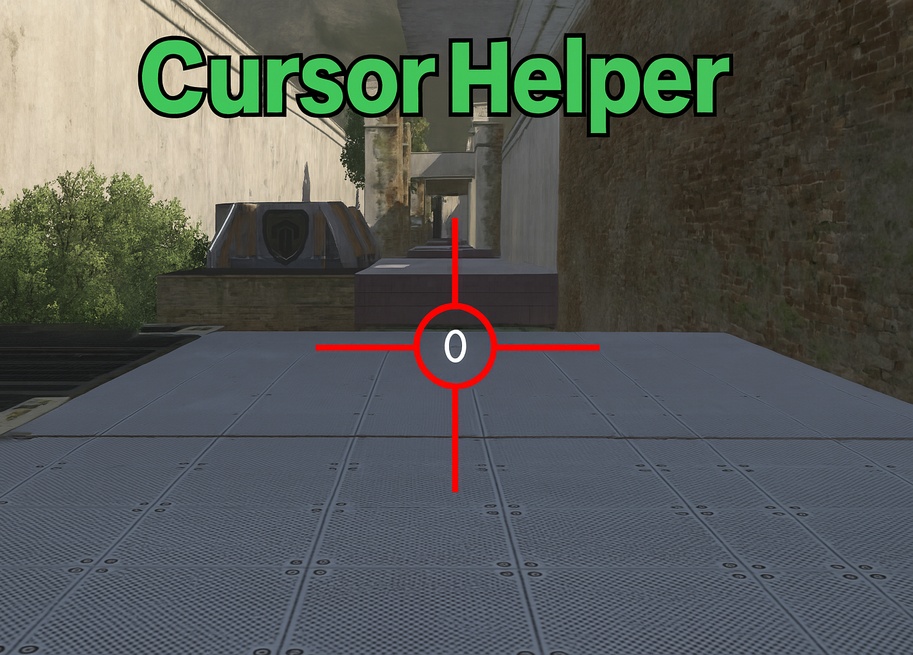
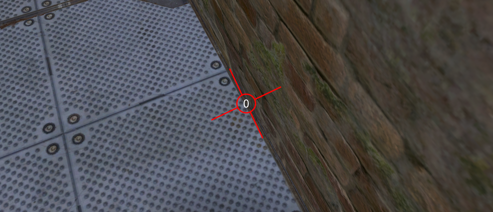

# CursorHelper

CursorHelper is a plugin for Openplanet4 that makes it easy to manage and customize the cursor in your game.

Its primary purpose is to be used in the game ShootMania Obstacle mode.

## Features

- Show and hide the cursor
- Customize the cursor appearance
- The cursor increases in size based on horizontal velocity
- Display the yaw of your character through the cursor to more easily find the correct angle for rocket wall jumps.
- Display horizontal velocity at the center of the cursor.
- Use sound as a tool to indicate the character's speed.

## Installation

1. Download the plugin and place it in the `Plugins` folder of your Openplanet4 installation.
2. Restart Openplanet4.
3. Switch to developer mode

## Usage

Import and use the plugin's functions in your scripts to control the cursor as needed.

## Contributing

Contributions are welcome! Open an issue or a pull request to suggest improvements.

## License

This project is licensed under the MIT License.
