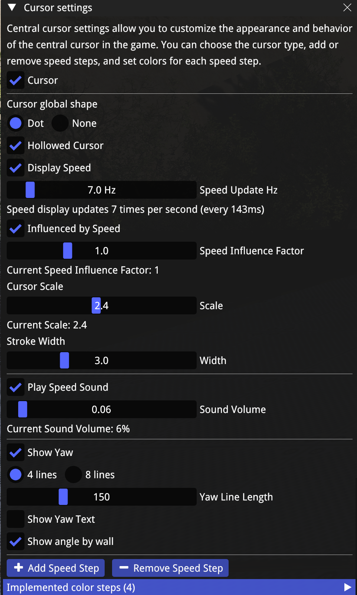
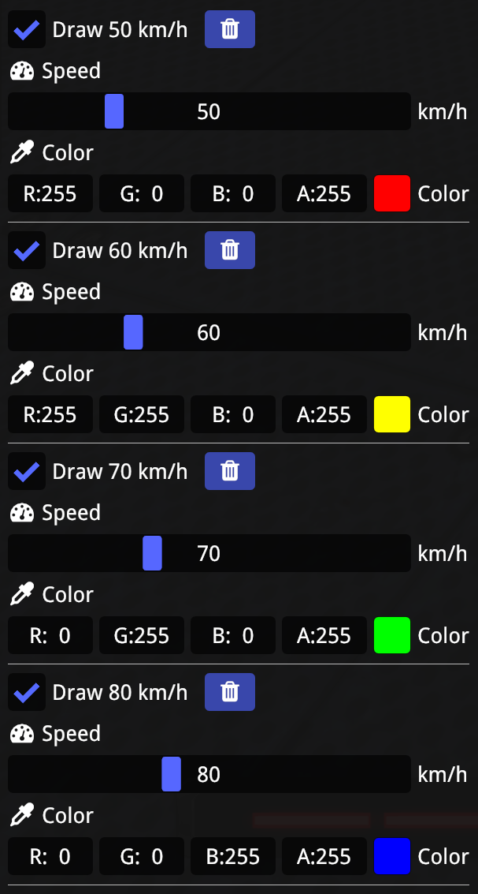
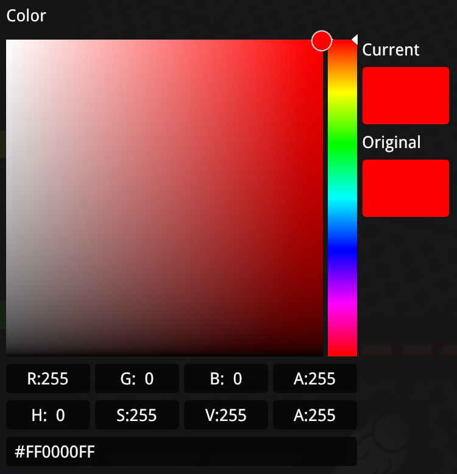

# 🎯 CursorHelper

<div align="center">

[](#)
[](#)
[](#)
[](#license)

**A powerful cursor customization plugin for Openplanet4**

*Enhance your ShootMania Obstacle mode experience with advanced cursor controls*


</div>

## 📖 About

CursorHelper is a feature-rich plugin for Openplanet4 that improuve cursor management and customization in your gaming experience. Specifically designed for **ShootMania Obstacle mode**, this plugin provides advanced cursor controls and visual feedback to help you master complex movements and improve your gameplay precision.

## ✨ Features

### 🎮 Core Functionality
- **🔄 Toggle Visibility**: Show and hide the cursor with ease
- **🎨 Customization**: Personalize cursor appearance to match your style
- **📏 Dynamic Sizing**: Cursor automatically scales based on horizontal velocity

### 🚀 Advanced Features
- **🧭 Yaw Display**: Visual representation of character yaw through cursor orientation
  - Perfect for finding optimal angles for rocket wall jumps
- **⚡ Velocity Indicator**: Real-time horizontal velocity display at cursor center
- **🔊 Audio Feedback**: Sound-based speed indication system

<div align="center">


*Advanced cursor features in action*

</div>

## 📦 Installation

### Prerequisites
- Openplanet4 installed and running
- Developer mode enabled

### Step-by-Step Guide

1. **📥 Download** the CursorHelper plugin
2. **📂 Navigate** to your Openplanet4 installation directory
3. **📁 Place** the plugin files in the `Plugins` folder
4. **🔄 Restart** Openplanet4
5. **⚙️ Enable** developer mode if not already active

```
Openplanet4/
├── Plugins/
│   └── CursorHelper/
│       ├── Main.as
│       ├── Settings.as
│       └── ...
```

## 🚀 Usage

### Configuration
Access the plugin settings through the Openplanet4 interface to customize:
- Cursor appearance and behavior
- Velocity scaling sensitivity
- Audio feedback preferences
- Display options

<div align="center">





</div>


## 🤝 Contributing

We welcome contributions from the community! Here's how you can help:

### Ways to Contribute
- 🐛 **Report Bugs**: Open an issue with detailed reproduction steps
- 💡 **Suggest Features**: Share your ideas for new functionality
- 🔧 **Submit Pull Requests**: Contribute code improvements
- 📖 **Improve Documentation**: Help make our docs better

### Getting Started
1. Fork the repository
2. Create a feature branch (`git checkout -b feature/amazing-feature`)
3. Commit your changes (`git commit -m 'Add amazing feature'`)
4. Push to the branch (`git push origin feature/amazing-feature`)
5. Open a Pull Request

## 📄 License

This project is licensed under the **MIT License** - see the [LICENSE](License.txt) file for details.

---

<div align="center">

**Made with ❤️ for the ShootMania community**

*If you find this plugin useful, consider giving it a ⭐!*

</div>
